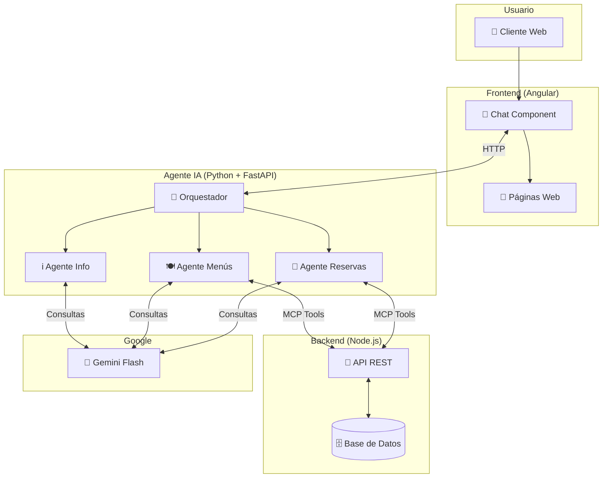
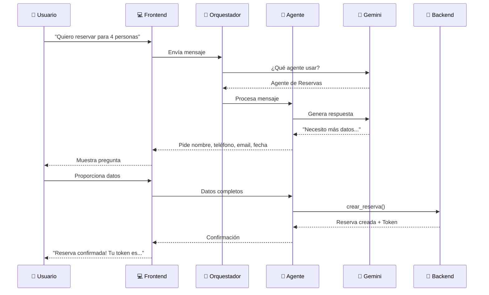

# 🤖 Capstone Project: Agente IA para Sistema de Reservas de Restaurante

**Autor:** Manuel Garrido Serrano  
**Fecha:** Noviembre 2025  
**Curso:** 5-Day Gen AI Intensive Course - Google & Kaggle

---

## 📋 Índice

1. [Resumen del Proyecto](#resumen-del-proyecto)
2. [¿Qué es el Procesamiento del Lenguaje Natural?](#qué-es-el-procesamiento-del-lenguaje-natural)
3. [Arquitectura del Sistema](#arquitectura-del-sistema)
4. [Capacidades Implementadas](#capacidades-implementadas)
5. [Detalles Técnicos](#detalles-técnicos)
6. [Reflexión y Aprendizajes](#reflexión-y-aprendizajes)
7. [Cómo Ejecutar el Proyecto](#cómo-ejecutar-el-proyecto)

---

## 🎯 Resumen del Proyecto

He desarrollado un **asistente virtual inteligente** para un restaurante que permite a los clientes:

- 📅 **Hacer reservas** mediante conversación natural
- 🍽️ **Consultar menús** y recibir recomendaciones
- 🔍 **Gestionar sus reservas** (consultar, modificar, cancelar)
- ⭐ **Valorar su experiencia** gastronómica
- ℹ️ **Obtener información** del restaurante (horarios, ubicación)

El asistente entiende lo que el usuario quiere decir en lenguaje natural y ejecuta las acciones correspondientes, como si hablara con un empleado real del restaurante.

---

## 💬 ¿Qué es el Procesamiento del Lenguaje Natural?

### Explicación Simple

El **Procesamiento del Lenguaje Natural (NLP)** es la capacidad de un ordenador para entender el lenguaje humano. En mi proyecto, esto significa que el usuario puede escribir cosas como:

> "Quiero reservar mesa para 4 personas mañana a las 8 de la tarde"

Y el sistema entiende que:
- **Acción:** Crear una reserva
- **Personas:** 4
- **Fecha:** Mañana
- **Hora:** 20:00

### ¿Por qué es útil en este proyecto?

| Sin NLP (Tradicional) | Con NLP (Mi Proyecto) |
|----------------------|----------------------|
| Formularios rígidos | Conversación natural |
| El usuario se adapta al sistema | El sistema se adapta al usuario |
| Menús y botones obligatorios | Escritura libre |
| Experiencia fría | Experiencia cercana y humana |

**Ejemplo real de mi sistema:**

```
Usuario: "Hola, me gustaría saber qué menú me recomiendan"

Agente: "¡Hola! 😊 Te recomiendo nuestro Menú Degustación Premium, 
        que tiene una valoración de 4.8/5 estrellas. Incluye..."
```

El agente entiende que el usuario quiere una recomendación y automáticamente consulta cuál es el menú mejor valorado.

---

## 🏗️ Arquitectura del Sistema

### Diagrama General



### Flujo de una Conversación



---

## 🚀 Capacidades Implementadas

He implementado **3 capacidades principales** del curso de AI Agents:

### 1. 🎭 Orquestación Multi-Agente

**¿Qué es?** Un sistema donde varios agentes especializados trabajan juntos, coordinados por un "jefe" (orquestador).

**¿Cómo lo implementé?**

```
                    ┌─────────────────┐
                    │   ORQUESTADOR   │
                    │  Analiza y      │
                    │  decide quién   │
                    │  responde       │
                    └────────┬────────┘
                             │
            ┌────────────────┼────────────────┐
            ▼                ▼                ▼
    ┌───────────────┐ ┌───────────────┐ ┌───────────────┐
    │ 📅 RESERVAS   │ │ 🍽️ MENÚS      │ │ ℹ️ INFO       │
    │               │ │               │ │               │
    │ - Crear       │ │ - Listar      │ │ - Horarios    │
    │ - Modificar   │ │ - Recomendar  │ │ - Ubicación   │
    │ - Cancelar    │ │               │ │ - Navegación  │
    │ - Consultar   │ │               │ │               │
    └───────────────┘ └───────────────┘ └───────────────┘
```

**Ejemplo:** Si el usuario pregunta "¿Qué menú tienen y a qué hora abren?", el orquestador envía la pregunta a DOS agentes (Menús + Info) que responden en paralelo.

### 2. 🔧 Function Calling (Tools/MCP)

**¿Qué es?** La capacidad del agente de ejecutar acciones reales, no solo responder con texto.

**¿Cómo lo implementé?**

El agente tiene acceso a estas herramientas:

| Herramienta | Descripción |
|-------------|-------------|
| `crear_reserva` | Crea una reserva en la base de datos |
| `modificar_fecha_reserva` | Cambia la fecha de una reserva |
| `cancelar_reserva` | Cancela una reserva existente |
| `consultar_reserva` | Obtiene información de una reserva |
| `get_menu_mas_valorado` | Obtiene el menú mejor puntuado |
| `listar_menus_disponibles` | Lista todos los menús |

**Ejemplo de flujo:**

```
Usuario: "Cancela mi reserva, mi token es ABC123"

Agente internamente:
1. Detecta intención: cancelar reserva
2. Extrae token: ABC123
3. Llama función: cancelar_reserva(token="ABC123")
4. Backend ejecuta la cancelación
5. Agente responde: "Tu reserva ha sido cancelada correctamente"
```

### 3. 💾 Memoria Conversacional

**¿Qué es?** El agente recuerda lo que se ha hablado antes en la misma conversación.

**¿Cómo lo implementé?**

- Cada agente mantiene su `chat_history`
- El historial se usa como contexto en cada mensaje
- Las sesiones se identifican con `session_id`

**Ejemplo:**

```
Usuario: "Quiero reservar para mañana"
Agente: "¡Perfecto! ¿Para cuántas personas?"

Usuario: "Para 4"
Agente: "Muy bien, 4 personas para mañana. ¿A qué hora?"
        (Recuerda que ya dijiste "mañana")

Usuario: "A las 8"
Agente: "Entendido. ¿Me das tu nombre, teléfono y email?"
        (Recuerda: mañana, 4 personas, 8 PM)
```

---

## 🔧 Detalles Técnicos

### Tecnologías Utilizadas

| Componente | Tecnología | Versión |
|------------|------------|---------|
| **Agente IA** | Python + FastAPI | 3.11 |
| **Modelo LLM** | Google Gemini Flash | 2.5 |
| **Frontend** | Angular | 17+ |
| **Backend** | Node.js + Express | 20+ |
| **Base de Datos** | MySQL | 8.0 |

### Modelo de Lenguaje

Uso **Gemini 2.5 Flash** por estas razones:

- ⚡ **Rápido**: Respuestas en menos de 1 segundo
- 💰 **Económico**: Menor coste que otros modelos
- 🔧 **Function Calling nativo**: Soporta herramientas directamente
- 🇪🇸 **Buen español**: Entiende y responde bien en castellano

### Configuración del Modelo

```python
# Para agentes especializados
GENERATION_CONFIG = {
    "temperature": 0.7,      # Balance creatividad/coherencia
    "top_p": 0.95,
    "max_output_tokens": 2048
}

# Para el orquestador
ORCHESTRATOR_CONFIG = {
    "temperature": 0.3,      # Más determinístico para routing
    "max_output_tokens": 512
}
```

### Estructura del Proyecto

```
📁 Proyecto Completo
│
├── 📁 Agente (Python)
│   ├── main.py              # API FastAPI
│   ├── multi_agents.py      # Definición de agentes
│   ├── agent_runner.py      # Sistema de ejecución
│   └── mcp_tools.py         # Herramientas MCP
│
├── 📁 Backend (Node.js)
│   ├── src/
│   │   ├── routes/          # Endpoints API
│   │   └── services/        # Lógica de negocio
│   └── database/            # Esquema SQL
│
└── 📁 Frontend (Angular)
    └── src/app/
        ├── pages/           # Páginas de la app
        └── services/        # Servicios HTTP
```

---

## 💭 Reflexión y Aprendizajes

### ¿Qué aprendí del curso?

#### Día 1-2: Fundamentos de LLMs
Aprendí cómo funcionan los modelos de lenguaje y cómo usar la API de Gemini. Esto me permitió crear agentes que "entienden" el lenguaje natural.

#### Día 3: Agentes y Function Calling
Descubrí que los LLMs pueden hacer más que generar texto: pueden ejecutar acciones. Implementé las MCP Tools para que mi agente realmente cree reservas en la base de datos.

#### Día 4: Arquitectura Multi-Agente
Aprendí a dividir un problema complejo en agentes especializados. En lugar de un agente gigante que hace todo, tengo varios expertos que colaboran.

#### Día 5: Evaluación y Mejoras
Entendí la importancia de probar y medir el rendimiento de los agentes.

### Desafíos que enfrenté

1. **Interpretación de fechas**: El usuario dice "mañana" o "el viernes" y el agente debe convertirlo a formato `YYYY-MM-DDTHH:mm`. Solucioné inyectando la fecha actual en el prompt.

2. **Coordinación de agentes**: A veces dos agentes querían responder a la misma pregunta. El orquestador resuelve esto decidiendo quién es el más adecuado.

3. **Validación de datos**: El agente debe verificar que el usuario proporcione todos los datos necesarios antes de crear una reserva. Implementé prompts específicos que guían la conversación.

### ¿Qué mejoraría en el futuro?

- 🔴 **Persistencia de sesiones**: Guardar conversaciones en Redis para que sobrevivan reinicios
- 🔴 **Evaluación automática**: Medir calidad de respuestas con métricas
- 🔴 **Más agentes**: Añadir agente de pagos, agente de eventos especiales
- 🔴 **Voice UI**: Permitir hablar en lugar de escribir

---

## 🚀 Cómo Ejecutar el Proyecto

### Requisitos Previos

- Python 3.9+
- Node.js 18+
- MySQL 8.0
- API Key de Google Gemini

### 1. Backend (Node.js)

```bash
cd Proyecto-4-Un-asistente-para-la-empresa-backend
npm install
# Configurar .env con credenciales de BD
npm start
# Servidor en http://localhost:3000
```

### 2. Agente IA (Python)

```bash
cd Proyecto-4-Un-asistente-para-la-empresa-Agente
python -m venv venv
venv\Scripts\activate  # Windows
pip install -r requirements.txt
# Configurar .env con GEMINI_API_KEY
python main.py
# Servidor en http://localhost:8000
```

### 3. Frontend (Angular)

```bash
cd Proyecto-4-Un-asistente-para-la-empresa-frontend/cliente-web
npm install
ng serve
# Aplicación en http://localhost:4200
```

### Probar el Sistema

1. Abre http://localhost:4200
2. Haz clic en el botón de chat (esquina inferior derecha)
3. Escribe: "Hola, quiero hacer una reserva"
4. ¡Sigue la conversación!

---

## 📚 Referencias

- [Google AI Studio](https://makersuite.google.com/)
- [Gemini API Documentation](https://ai.google.dev/docs)
- [5-Day Gen AI Intensive Course](https://www.kaggle.com/learn-guide/5-day-genai)
- [FastAPI Documentation](https://fastapi.tiangolo.com/)
- [Angular Documentation](https://angular.io/docs)

---

## 📝 Licencia

Este proyecto fue desarrollado como parte del curso de 5 días de AI Agents de Google y Kaggle.

**Repositorios:**
- Agente: https://github.com/AxoneDesktop/Proyecto-4-Un-asistente-para-la-empresa-Agente
- Backend: https://github.com/AxoneDesktop/Proyecto-4-Un-asistente-para-la-empresa-backend
- Frontend: https://github.com/AxoneDesktop/Proyecto-4-Un-asistente-para-la-empresa-frontend
