# 🤖 Capstone Project: AI Agent for Restaurant Reservation System

**Author:** Manuel Garrido Serrano  
**Date:** November 2025  
**Course:** 5-Day Gen AI Intensive Course - Google & Kaggle

---

## 📋 Table of Contents

1. [Project Summary](#project-summary)
2. [What is Natural Language Processing?](#what-is-natural-language-processing)
3. [System Architecture](#system-architecture)
4. [Implemented Features](#implemented-features)
5. [Technical Details](#technical-details)
6. [Reflection & Learnings](#reflection--learnings)
7. [How to Run the Project](#how-to-run-the-project)

---

## 🎯 Project Summary

I developed an **intelligent virtual assistant** for a restaurant that allows customers to:

- 📅 **Make reservations** through natural conversation
- 🍽️ **Browse menus** and receive recommendations
- 🔍 **Manage reservations** (query, modify, cancel)
- ⭐ **Rate their experience**
- ℹ️ **Get information** about the restaurant (hours, location)

The assistant understands what the user means in natural language and executes the corresponding actions, as if talking to a real restaurant employee.

---

## 💬 What is Natural Language Processing?

### Simple Explanation

**Natural Language Processing (NLP)** is a computer's ability to understand human language. In my project, this means the user can write things like:

> "I want to book a table for 4 people tomorrow at 8 PM"

And the system understands:
- **Action:** Create a reservation
- **People:** 4
- **Date:** Tomorrow
- **Time:** 8:00 PM

### Why is it useful in this project?

| Without NLP (Traditional) | With NLP (My Project) |
|---------------------------|----------------------|
| Rigid forms | Natural conversation |
| User adapts to system | System adapts to user |
| Mandatory menus and buttons | Free writing |
| Cold experience | Warm, human-like experience |

**Real example from my system:**

```
User: "Hi, I'd like to know what menu you recommend"

Agent: "Hello! 😊 I recommend our Premium Tasting Menu, 
        which has a 4.8/5 star rating. It includes..."
```

The agent understands the user wants a recommendation and automatically queries which menu has the highest rating.

---

## 🏗️ System Architecture

### General Diagram

```mermaid
flowchart TB
    subgraph User
        A[👤 Web Client]
    end
    
    subgraph Frontend["Frontend (Angular)"]
        B[💬 Chat Component]
        C[📄 Web Pages]
    end
    
    subgraph Agent["AI Agent (Python + FastAPI)"]
        D[🎯 Orchestrator]
        E[📅 Reservations Agent]
        F[🍽️ Menus Agent]
        G[ℹ️ Info Agent]
    end
    
    subgraph Backend["Backend (Node.js)"]
        H[🔌 REST API]
        I[(🗄️ Database)]
    end
    
    subgraph Google
        J[🧠 Gemini Flash]
    end
    
    A --> B
    B --> C
    B <-->|HTTP| D
    D --> E & F & G
    E & F & G <-->|Queries| J
    E & F <-->|MCP Tools| H
    H <--> I
```



### Conversation Flow

```mermaid
sequenceDiagram
    participant U as 👤 User
    participant F as 💻 Frontend
    participant O as 🎯 Orchestrator
    participant A as 🤖 Agent
    participant G as 🧠 Gemini
    participant B as 🔌 Backend
    
    U->>F: "I want to book for 4 people"
    F->>O: Send message
    O->>G: Which agent to use?
    G-->>O: Reservations Agent
    O->>A: Process message
    A->>G: Generate response
    G-->>A: "I need more data..."
    A-->>F: Asks for name, phone, email, date
    F-->>U: Shows question
    U->>F: Provides data
    F->>A: Complete data
    A->>B: create_reservation()
    B-->>A: Reservation created + Token
    A-->>F: Confirmation
    F-->>U: "Reservation confirmed! Your token is..."
```



---

## 🚀 Implemented Features

I implemented **3 key features** from the AI Agents course:

### 1. 🎭 Multi-Agent Orchestration

**What is it?** A system where several specialized agents work together, coordinated by a "boss" (orchestrator).

**How did I implement it?**

```
                    ┌─────────────────┐
                    │   ORCHESTRATOR  │
                    │  Analyzes and   │
                    │  decides who    │
                    │  responds       │
                    └────────┬────────┘
                             │
            ┌────────────────┼────────────────┐
            ▼                ▼                ▼
    ┌───────────────┐ ┌───────────────┐ ┌───────────────┐
    │ 📅 RESERVATIONS│ │ 🍽️ MENUS      │ │ ℹ️ INFO       │
    │               │ │               │ │               │
    │ - Create      │ │ - List        │ │ - Hours       │
    │ - Modify      │ │ - Recommend   │ │ - Location    │
    │ - Cancel      │ │               │ │ - Navigation  │
    │ - Query       │ │               │ │               │
    └───────────────┘ └───────────────┘ └───────────────┘
```

**Example:** If the user asks "What menu do you have and what time do you open?", the orchestrator sends the query to TWO agents (Menus + Info) that respond in parallel.

### 2. 🔧 Function Calling (Tools/MCP)

**What is it?** The agent's ability to execute real actions, not just respond with text.

**How did I implement it?**

The agent has access to these tools:

| Tool | Description |
|------|-------------|
| `crear_reserva` | Creates a reservation in the database |
| `modificar_fecha_reserva` | Changes the date of a reservation |
| `cancelar_reserva` | Cancels an existing reservation |
| `consultar_reserva` | Gets information about a reservation |
| `get_menu_mas_valorado` | Gets the highest-rated menu |
| `listar_menus_disponibles` | Lists all menus |

**Flow example:**

```
User: "Cancel my reservation, my token is ABC123"

Agent internally:
1. Detects intent: cancel reservation
2. Extracts token: ABC123
3. Calls function: cancelar_reserva(token="ABC123")
4. Backend executes the cancellation
5. Agent responds: "Your reservation has been cancelled successfully"
```

### 3. 💾 Conversational Memory

**What is it?** The agent remembers what has been discussed earlier in the same conversation.

**How did I implement it?**

- Each agent maintains its own `chat_history`
- History is used as context in each message
- Sessions are identified with `session_id`

**Example:**

```
User: "I want to book for tomorrow"
Agent: "Perfect! For how many people?"

User: "For 4"
Agent: "Alright, 4 people for tomorrow. What time?"
        (Remembers you already said "tomorrow")

User: "At 8"
Agent: "Got it. Can you give me your name, phone and email?"
        (Remembers: tomorrow, 4 people, 8 PM)
```

---

## 🔧 Technical Details

### Technologies Used

| Component | Technology | Version |
|-----------|------------|---------|
| **AI Agent** | Python + FastAPI | 3.11 |
| **LLM Model** | Google Gemini Flash | 2.5 |
| **Frontend** | Angular | 17+ |
| **Backend** | Node.js + Express | 20+ |
| **Database** | MySQL | 8.0 |

### Language Model

I use **Gemini 2.5 Flash** for these reasons:

- ⚡ **Fast**: Responses in less than 1 second
- 💰 **Economical**: Lower cost than other models
- 🔧 **Native Function Calling**: Supports tools directly
- 🇪🇸 **Good Spanish**: Understands and responds well in Spanish

### Model Configuration

```python
# For specialized agents
GENERATION_CONFIG = {
    "temperature": 0.7,      # Balance creativity/coherence
    "top_p": 0.95,
    "max_output_tokens": 2048
}

# For the orchestrator
ORCHESTRATOR_CONFIG = {
    "temperature": 0.3,      # More deterministic for routing
    "max_output_tokens": 512
}
```

### Project Structure

```
📁 Complete Project
│
├── 📁 Agent (Python)
│   ├── src/
│   │   ├── main.py              # FastAPI API
│   │   ├── multi_agents.py      # Agent definitions
│   │   ├── agent_runner.py      # Execution system
│   │   └── mcp_tools.py         # MCP Tools
│   ├── tests/                   # Unit tests
│   ├── docs/                    # Documentation
│   └── run.py                   # Entry point
│
├── 📁 Backend (Node.js)
│   ├── src/
│   │   ├── routes/              # API endpoints
│   │   └── services/            # Business logic
│   └── database/                # SQL schema
│
└── 📁 Frontend (Angular)
    └── src/app/
        ├── pages/               # App pages
        └── services/            # HTTP services
```

---

## 💭 Reflection & Learnings

### What I learned from the course?

#### Days 1-2: LLM Fundamentals
I learned how language models work and how to use the Gemini API. This allowed me to create agents that "understand" natural language.

#### Day 3: Agents and Function Calling
I discovered that LLMs can do more than generate text: they can execute actions. I implemented MCP Tools so my agent actually creates reservations in the database.

#### Day 4: Multi-Agent Architecture
I learned to divide a complex problem into specialized agents. Instead of one giant agent that does everything, I have several experts that collaborate.

#### Day 5: Evaluation and Improvements
I understood the importance of testing and measuring agent performance.

### Challenges I faced

1. **Date interpretation**: The user says "tomorrow" or "Friday" and the agent must convert it to `YYYY-MM-DDTHH:mm` format. I solved this by injecting the current date into the prompt.

2. **Agent coordination**: Sometimes two agents wanted to respond to the same question. The orchestrator solves this by deciding who is most appropriate.

3. **Data validation**: The agent must verify that the user provides all necessary data before creating a reservation. I implemented specific prompts that guide the conversation.

### What would I improve in the future?

- 🔴 **Session persistence**: Store conversations in Redis to survive restarts
- 🔴 **Automated evaluation**: Measure response quality with metrics
- 🔴 **More agents**: Add payment agent, special events agent
- 🔴 **Voice UI**: Allow speaking instead of typing

---

## 🚀 How to Run the Project

### Prerequisites

- Python 3.9+
- Node.js 18+
- MySQL 8.0
- Google Gemini API Key

### 1. Backend (Node.js)

```bash
cd Proyecto-4-Un-asistente-para-la-empresa-backend
npm install
# Configure .env with DB credentials
npm start
# Server at http://localhost:3000
```

### 2. AI Agent (Python)

```bash
cd Proyecto-4-Un-asistente-para-la-empresa-Agente
python -m venv venv
venv\Scripts\activate  # Windows
pip install -r requirements.txt
# Configure .env with GEMINI_API_KEY
python run.py
# Server at http://localhost:8000
```

### 3. Frontend (Angular)

```bash
cd Proyecto-4-Un-asistente-para-la-empresa-frontend/cliente-web
npm install
ng serve
# Application at http://localhost:4200
```

### Test the System

1. Open http://localhost:4200
2. Click the chat button (bottom right corner)
3. Type: "Hello, I want to make a reservation"
4. Follow the conversation!

---

## 📚 References

- [Google AI Studio](https://makersuite.google.com/)
- [Gemini API Documentation](https://ai.google.dev/docs)
- [5-Day Gen AI Intensive Course](https://www.kaggle.com/learn-guide/5-day-genai)
- [FastAPI Documentation](https://fastapi.tiangolo.com/)
- [Angular Documentation](https://angular.io/docs)

---

## 📝 License

This project was developed as part of Google and Kaggle's 5-Day AI Agents course.

**Repositories:**
- Agent: https://github.com/AxoneDesktop/Proyecto-4-Un-asistente-para-la-empresa-Agente
- Backend: https://github.com/AxoneDesktop/Proyecto-4-Un-asistente-para-la-empresa-backend
- Frontend: https://github.com/AxoneDesktop/Proyecto-4-Un-asistente-para-la-empresa-frontend
